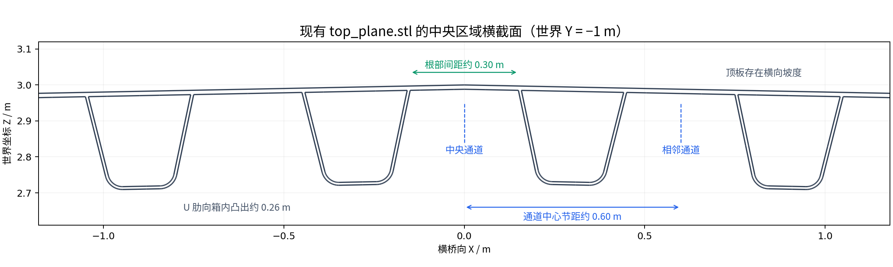
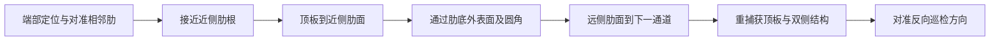

**钢桥顶板 U 肋通道遍历巡检：D415 视觉匹配与定位技术方案**

本方案以当前 `gazebo_bridge` 几何为依据，范围是通道内巡检、通道末端定位、相邻通道切换和换道后重新匹配。根据用户补充，小车尺寸适配通道，磁吸二轮小车的附着、翻肋和内直角通过能力视为已具备，不再评估机械可通过性；后续可增加精度不高的六轴 IMU。暂不处理跨越三道正向板的问题。采用已知结构约束下的定位和顺序遍历，不设置在线建图、全局路径搜索或 SLAM 回环模块。

建议先实现“单通道稳定定位 → 经正向板完成一次换道 → 多通道蛇形遍历”，再比较直接翻越 U 肋的效果。这个实施顺序以视觉验证难度为依据，并不预先认定第一种路线在所有位置都更优。最终选择应由相机可见性、误差增长和换道试验决定。

**1．现有场景提供了哪些依据。** 已检查 [场景文件](../gazebo_bridge/worlds/bridge.world)、[模型文件](../gazebo_bridge/models/bridge/model.sdf)、[导出说明](../bridge_export_package/README.md) 和顶板 STL 的实际截面。

| 已确认的事实 | 对方案的影响 |
|---|---|
| `top_plane.stl` 同时包含顶板、上部翼板和 U 肋，模型只有一个 `bridge_link` | 运行时不能依赖 Gazebo 的 link 名称直接获取每根肋的位置；需要离线提取结构特征并赋予编号 |
| STL 使用毫米，SDF 缩放为 `0.001`；世界中模型绕 X 轴旋转 `+π/2` | 原 CAD 点到世界的变换为 `(x,y,z)_world = 0.001 × (X,−Z,Y)_CAD`，所有先验和相机标定要使用同一坐标约定 |
| 网格纵向 CAD Z 范围为 `−4000～4000 mm` | 世界纵向为 Y，总长度约 8 m；这不表示当前完整场景内有可直接驶通的 8 m 通道 |
| 中央代表截面的 U 肋节距约 0.60 m，根部间通道宽约 0.30 m，肋高约 0.26 m | 相机安装、两侧焊缝同框和近距盲区必须在这些尺度下验证 |
| 顶板横截面存在横向坡度，中央有折线 | “地面”应定义为车轮当前吸附的局部承载面，不能固定成世界水平面或图像下半部 |
| `front_plane_01/02/03` 主板 CAD Z 分别约为 `2.6/−0.4/−3.4 m` | 对应世界 Y 约为 `−2.6/0.4/3.4 m`，它们是模型内部正向板；不能默认世界纵向 `±4 m` 处另有封闭端板 |
| 当前 SDF 为统一材质的结构网格，没有独立焊缝对象、相机或小车配置 | 现有结构交线可以验证几何定位，尚不能据此宣称已验证真实焊缝 RGB 识别 |

下图直接截取现有网格，显示中央代表区域。尺寸取近似值，不作为整桥所有通道完全等宽的依据。复现脚本为 [plot_bridge_section.py](assets/plot_bridge_section.py)。

第一轮换道试验可选两道已有正向板之间的局部单元，在单元边界利用正向板换道，不涉及穿越正向板。整桥先验应保存实际邻接关系，对被其他结构隔开的区域分别定义遍历序列。

**2．首先区分“能够被观测的位置”和“只能暂时推算的位置”。** 系统对外输出 `(channel_id, s, e, heading_error, surface_id, transition_phase, confidence)`：分别表示通道编号、沿通道里程、横向偏差、相对通道朝向、当前吸附面、换道阶段和置信度。内部保留三维位姿及协方差，使顶板、正向板、肋侧面之间的姿态变化能连续表达。

| 当前有效观测 | 能提供的主要约束 | 不能独立确定的量 |
|---|---|---|
| 一个无纹理承载平面 | 相机到平面的法向距离、相对平面的两个倾斜角 | 平面内两方向位移，以及绕平面法向的转角 |
| 顶板平面和左右两条平行纵向结构线 | 横向位置、相对通道朝向、贴面姿态；已知语义下的局部横截面匹配 | 沿通道的绝对位置；完全重复结构中的绝对通道编号 |
| 顶板和正向板两个非平行平面 | 相对姿态、相对两面的距离，尤其是距通道端部的距离 | 沿两面交线的平移 |
| 上述结构加一个已正确关联的孔角、端点或非重复边界 | 可补足缺失方向的位置约束 | 重复目标的数据关联仍需要历史和邻接关系 |
| 轮编码器 | 短时间相对运动及纵向里程 | 打滑后的真实位移、绝对位置 |
| 外置六轴 IMU（可选增强） | 角速度连续性及可用时的重力方向 | 长时间绝对平移、无漂移的绝对航向 |

这些限制来自几何对称性：在理想长通道里沿焊缝方向平移，平面和两条无限长直线的观测关系不变。因此，纵向位置以编码器积分为主，在可见端板、结构端点等位置校正。可以用自然纹理的短时帧间匹配改善相对里程，但不将其视为始终存在的约束。

启动时应指定已知通道和起始端，或识别一个已有的唯一结构。完全相同的多个通道，无法仅凭一张局部 RGB-D 图像恢复全局编号。正常遍历靠连续跟踪和经过确认的相邻换道维持编号；丢失后不能直接全桥搜索一个最相似通道并宣告定位成功。

**3．把 Gazebo 标准模型整理成小型结构先验。** 离线读取 CAD/STL，保存以下对象即可，无需生成占据栅格：每个局部顶板面的平面方程、每个通道的左右焊缝参考线与范围、通道中心方向和长度、U 肋截面、正向板平面及可用孔边/加强件、通道邻接关系和两类换道动作模板。

具体处理顺序为：统一单位和坐标 → 选择代表纵向截面 → 提取顶板与肋外表面的连接位置 → 沿纵向确认其延伸及中断范围 → 标注通道和端部特征 → 人工核对一次。不要将所有 STL 三角形边直接当成真实棱线；同一光滑曲面上的三角剖分边没有视觉地标意义。

将参考几何组织为 `surface_id → channel_id → left/right structural_line → endpoint/transition`。同一根肋的两侧连接线拥有独立结构 ID；车辆掉头后，相机画面的左右会交换，结构 ID 不交换。

标准图仅提供粗先验。真实安装偏差、坡度和焊接变形通过当前观测修正局部误差，设置合理的模型公差；无需更新成全局地图。以“从已知端部向通道内部的距离”定义固定的 `s`，行驶方向另存标志，掉头时不能把物理焊缝的里程定义也反转。

**4．D415 的安装和数据配置先于算法选型。** D415 的 HD 深度名义视场约为 `65°×40°`，深度和 RGB 均为 rolling shutter，且不自带 IMU。参数依据 [D415 官方产品页](https://www.realsenseai.com/products/stereo-depth-camera-d415/)。

官方资料列出的默认最小 Z 深度随分辨率变化：

| 深度分辨率 | D415 最小 Z 深度 |
|---|---:|
| `1280×720` | 约 0.45 m |
| `848×480` | 约 0.31 m |
| `640×480` | 约 0.31 m |
| `640×360` | 约 0.24 m |

数据来源为 [D400 系列 Datasheet 的 Table 4-11](https://realsenseai.com/wp-content/uploads/dlm_uploads/2025/08/Intel-RealSense-D400-Series-Datasheet-August-2025.pdf)。这里的 Z 是相机光轴方向深度，不是车体到钢板的垂直高度。上述极限也不是钢材表面稳定测量距离的保证。

采用刚性安装的单台 D415 作为基线方案：相机朝行进方向，并向当前吸附面倾斜，让前方一段左右焊缝和承载面同时进入有效深度区。对于附着在顶板内表面的小车，“朝吸附面倾斜”可能在世界坐标中是朝上，不能直接套用普通地面车的“向下看”。

以 0.30 m 的通道宽粗算，在同一深度截面内水平视场容纳双侧结构至少需要 `Z ≥ W/[2 tan(HFOV/2)] ≈ 0.24 m`。这只是理想水平视场下界；有效双目重叠区、画面边缘余量、俯仰安装、肋体遮挡和 Min-Z 会进一步限制可用位置。不能由“宽度放得进图像”推断“能取得两侧有效深度”。

安装设计应对整套动作做射线可见性扫描，输出每个姿态下的双侧焊缝可见长度、有效深度比例、可见平面数量和连续退化时长。先扫描安装高度、俯仰角、前伸量和分辨率，再选参数。可从 `1280×720 @ 30 Hz` 的远前视观测方案开始试验，与较低分辨率的近距模式比较；相机到目标的实际有效区由安装和实测确定。

标定相机内参、RGB/深度外参、相机到车体的外参、轮径/轮距和时间偏差。RGB-D 对齐并不等于时间同步，转弯时需要正确的时间戳。转面时限制角速度，必要时在关键观察位短暂停顿，以降低 rolling shutter 与运动模糊影响。

钢板反光、弱纹理和斜视会造成深度空洞或错误点。官方 [Depth Quality Testing 文档](https://www.realsenseai.com/wp-content/uploads/2019/11/RealSense_DepthQualityTesting.pdf) 也指出反光表面会影响视觉深度测量。通过照明、曝光和安装角度试验改善；不要把空洞填补结果当成高置信测量。补光只改善成像条件，不能自动解决镜面反射。

若允许增加传感器，优先使用一个外置六轴 IMU 维持翻面时的角运动估计。桥体和磁吸轮环境下不依赖磁力计给绝对航向。加速度中的重力约束只在运动加速度允许时使用；陀螺也需要偏置估计。单 D415 加编码器仍可做基线试验，但视觉完全缺失时的三维转面误差必须通过实测限定。

用户已说明后续可加低精度六轴 IMU，因此将它作为换道阶段的优先增强项，职责限定为“短时姿态衔接和运动一致性检查”：

1. 启动及确认静止的观察位估计陀螺零偏；记录温度变化与振动影响。采样可从 100～200 Hz 作为工程起点，重点保证时间戳和相机/编码器对齐。
2. 翻面时用陀螺角速度积分跟踪旋转，编码器和过渡模型传播位置；不使用低精度加速度的二次积分作为换道位移的主要来源。
3. 在稳定贴面、低动态且加速度数据一致时，使用重力方向提供倾斜约束；翻面冲击和急转弯期间降低这一约束的权重。
4. 结构重新可见后，用平面/结构线修正其可观测的姿态方向，再结合多个阶段的观测估计偏置。只有单平面时，仍不能校正绕其法向的全部旋转误差。
5. 仿真分别比较“无 IMU”“带噪声和偏置的 IMU”“理想 IMU”，避免用理想传感器掩盖退化问题。型号确定后，以实测静态零偏、运动噪声和温漂替换假设。

例如，假设校准后的某轴残余角速度偏置为 `0.2°/s`，3 s 内仅该项带来的角误差约为 `0.6°`；若用这个角误差保守估计 0.6 m 横移的航向影响，横向误差量级约为 `0.6 × sin(0.6°) ≈ 6.3 mm`。这只是说明短时使用的误差如何估算，不是对拟选 IMU 的精度承诺，也没有包括打滑、随机噪声和转面模型误差。低精度 IMU 能缩短姿态信息的空白，但不能使任意长的无特征横移变得可观测。

**5．视觉前端采用“几何给约束，RGB 精化焊缝”。** 建议按以下顺序构建，不以整幅图像特征匹配作为主要定位来源。

1. 对原始深度做有效性掩码和保边滤波，使用标定参数生成点云，保留原始有效像素标志。过强时域滤波在转面时可能拖影，应随运动状态调整。
2. 在预测的可见区域内拟合多个平面，以法向、距离、空间支持范围及当前动作阶段识别承载面、U 肋侧面、正向板。基线可用 RANSAC 加连通区域分析；不要永远选择面积最大的平面作为承载面。
3. 从顶板面与左右肋侧面估计名义连接线 `L_left = Π_top ∩ Π_left`、`L_right = Π_top ∩ Π_right`。平面支持应避开焊道圆角和混合深度点；肋底弧面使用局部法向或截面轮廓，不能硬拟合为完整平面。
4. 将名义连接线投影到 RGB，围绕预测位置建立 ROI。先用线段/边缘检测与方向、宽度、连续性约束建立基线；真实样本足够后，可改为焊缝带分割，再拟合中心线。
5. 对 RGB 焊缝候选进行三维一致性核对。连接线提供结构定位基准，真实焊道可能有宽度及偏移，两者应分别输出。深度支持不足时保留二维候选及较低置信度，不强行输出精确三维焊缝。
6. 在短时间内跟踪线条，利用投影误差、点到线/平面残差、方向一致性及预期肋间距进行关联；轮速预测限定搜索窗口。

当前模型的颜色和几何交线足以做结构提取原型，但真实 RGB 焊缝算法还需要实物数据，或带焊道、涂装、光照随机变化的仿真资产。不能只在交线上画高对比细线，再把由此得到的识别率作为真实焊缝性能。

**6．融合定位采用随吸附面切换的局部估计器。** 第一版采用 EKF/ESKF 或等价的局部加权估计即可；算法名称不是关键，关键是只在观测确实提供信息的方向修正状态。

建议内部状态包括车体三维位置 `p`、姿态 `q`、速度、必要的轮速标定项；增加 IMU 时再加入陀螺和加速度偏置。离散状态另存通道 ID、吸附面 ID 和动作阶段。对外输出协方差或各方向误差区间，而非只输出一个位置数值。

在左右轮同处一个稳定平面、近似纯滚动时：

`Δl = (r_R Δθ_R + r_L Δθ_L)/2`

`Δψ = (r_R Δθ_R − r_L Δθ_L)/b`

其中 `b` 为有效轮距，增量沿当前表面的切平面传播。标定有效轮径、轮距和不同平面上的里程误差；打滑时增大过程噪声。翻越棱边、两轮不同面或支撑关系变化时，不能继续直接使用固定世界 XY 平面的差速里程模型。

过渡段采用经过小车几何和试验标定的动作/接触模型 `T(λ)`，其中 `λ` 表示沿过渡过程的进度；根据编码器预测，有 IMU 时加入旋转观测，并用可见平面、边缘更新。`T(λ)` 是带误差的预测模板，不能当成真实位姿观测。恢复稳定吸附面后再切回常规贴面传播。

视觉更新使用点到平面残差、结构线方向/距离残差、RGB 线的投影残差，以及端部特征残差。结合残差、深度有效率、观测跨度和信息矩阵的弱约束方向调整权重。由同一组点派生的平面和交线存在相关性，应保守加权或共同处理，避免把同一信息重复计算后产生虚假高置信度。

在只看见长直线和平面的阶段，允许纵向协方差随里程增长。只有出现可辨识的纵向锚点，才明显收紧纵向位置；标准 CAD 或一次 ICP 收敛本身不构成纵向位置被观测到的证据。

**7．方案一：经正向板换道。** 本文将该路线理解为“当前顶板通道 → 正向板表面 → 横移到相邻通道入口 → 返回顶板”。正向板上的目标通常同时具有横向位移和随顶板坡度变化的高度差，不能简化成世界坐标中纯水平走固定距离。

动作序列为：

开始转面前，在有效测距范围内同时观察当前通道和正向板，校正纵向端部距离，并保存与当前通道相关的入口、孔边或加强件。随后短距离接近可能进入 Min-Z 盲区，这段也必须列入预测区间，不能等相机已经过近才开始寻找端板。

在正向板上看不到 U 肋时，按三种情况控制：

| 正向板阶段的可见内容 | 运动和定位方式 |
|---|---|
| 可见顶板与正向板交线、肋端轮廓、孔边或加强件 | 切换到这些结构的匹配，编码器提供先验，保持视觉修正 |
| 只看得到稳定平面，但看不到边界或纹理 | 用平面约束贴面距离和倾斜；表面内横移量、航向主要靠里程和可选 IMU 短时预测 |
| 目标过近、遮挡或深度整体无效 | 只允许在预先验证的动作区间内短时推进，增加不确定度；到预期观察位减速或停顿重捕获 |

因此，“看不到 U 肋”不必等于停止运动，但“只有一面平板”也不能被当成完整视觉定位。应在 CAD 中找一条可保持顶板边界、肋端或孔边可见的正向板带状区域，并验证到下一入口存在可用的观察位。孔边并非每处都能看见，其可见性必须随相机位姿验证。

通常先在正向板上对准横向目标，移动到下一入口附近，再对准返回顶板的方向；是否原地旋转、分几段旋转由已有底盘运动原语确定。路线比较应计入这些额外转向导致的视觉退化时间。

入口重捕获时只匹配当前通道及预定相邻通道候选。要求观测位置与横移历史相符、双侧间距和方向相符、承载面相符，且连续若干帧稳定后才确认换道。试验初期可从 5～10 帧确认窗口开始调整；跨帧观测高度相关，不能把这一窗口当成统计保证。

若始终只有无纹理平面，且预测误差在到达下一可观测区域之前已经超过允许范围，这个安装和动作组合就不满足运行要求。需要调整相机朝向/动作观察位，或在允许时增加 IMU、可读角度的相机转台、辅助相机/人工参考特征。不能通过提高滤波权重消除本来不存在的观测。

**8．方案二：直接翻越相邻 U 肋。** 同样在完成当前通道后实施。先保留端部定位结果，在距离端板具有适当观察余量的位置转向相邻 U 肋，经过近侧肋面、肋底外表面和远侧肋面，回到下一通道的顶板，再对准反向巡检方向。

每一段采用不同特征模板：顶板段匹配顶板与肋根；肋侧面段匹配当前侧面及可见的相邻面；圆角段匹配局部截面/法向变化；离肋段匹配远侧根部和下一通道双侧结构。承载面 ID 随动作阶段切换，不能把新出现的大平面当成错误匹配后丢弃。

跨肋的运动距离由实际外表面路径和轮径、相机杆臂、接触几何共同确定，不能用“横向节距 0.60 m”直接换算编码器转数。相机绕轮轴转动也会产生明显平移，应通过外参传播。

这条路线的潜在优点是邻接关系明确，可能减少在大面积无纹理正向板上的移动；但不能仅凭外形认定路线更短或定位更好。翻肋过程中转面更多，相机容易进入近距盲区或只看到肋体局部，深度观测可能比方案一更差。已知肋截面有助于限制跨肋进度，却不能自动消除沿肋纵向的漂移。

优先在仍能间歇看到端板的位置进行跨肋试验，用端板距离约束沿肋方向的位置。需要的观察余量、额外行驶与末端焊缝补拍区间一起设计。若在通道中段翻肋，则明确接受纵向里程主要靠传播，直到再次看到纵向锚点。

**9．两种路线如何选择。** 在相同相机安装、速度预算、深度失效和轮速误差条件下比较，不先以机械可通过性筛选，因为它已经是本项目的前提。

| 比较项 | 经正向板换道 | 直接翻 U 肋 |
|---|---|---|
| 核心定位问题 | 正向板内横向位移可能缺乏视觉约束 | 连续转面、近距盲区和接触模型切换 |
| 可用参考 | 顶板交线、肋端、孔边、加强件 | 肋截面、侧面/圆角、端板、相邻通道 |
| 主要姿态变化 | 两次顶板/正向板过渡及板上转向 | 多段表面法向变化及跨肋前后转向 |
| 最需要验证的误差 | 横移误差、入口识别错误 | 转面姿态误差、跨肋进度和纵向漂移 |
| 第一阶段建议 | 有可见横移参考时先做 | 作为对照；方案一长时间不可观测时可优先试验 |

决定指标为最长连续退化区间、到重捕获位置的误差范围、错误通道确认率、恢复成功率和总换道时间。只有在这些指标满足后，才用速度优势选择默认路线。不同端部允许配置不同换道模板。

**10．退化处理必须有可计算的边界。** 设置 `TRACKING`、`DEGRADED`、`REACQUIRE`、`HOLD` 四种定位工作状态，和几何动作阶段分别管理。

`TRACKING` 表示当前任务所需方向约束足够；`DEGRADED` 表示仍能运动但部分方向只靠传播；`REACQUIRE` 表示正在验证预期结构；`HOLD` 表示到达误差或可见性边界。单条焊缝、单平面、完全失去深度应拥有不同协方差，不能简单归为同一个“视觉正常”。

例如，设目标入口可容纳小车中心的横向余量为 `m = (W − B_eff)/2 − margin`，其中 `B_eff` 包括车体/相机外形及朝向误差引起的扫掠宽度。短距离 `L` 内航向误差产生的横向偏移约为 `L × δψ`，再叠加轮速和打滑误差。

进入下一入口前检查保守误差界 `|e_pred| + 3σ_e + E_unmodelled < m`。其中 `E_unmodelled` 用于覆盖模型偏差及非高斯打滑，不把 `3σ` 本身当作保证。参数应由车体尺寸和试验得到，因此本阶段不指定一个适用于所有动作的“可以盲走几秒”。

把连续无有效定位的时间、距离和角度也设为上限。达到上限时停在预定可保持吸附的位置，执行经过验证的观察动作；若当前位置几何上不可观测，单纯等待没有帮助。仅当已验证反向原语可用时返回上一个观察位，否则保持并报告需要恢复。车辆可运动，不代表可以无限期依赖编码器消除打滑影响。

**11．遍历和巡检记录。** 使用已知邻接序列，执行 `通道 i 正向 → 换道 → 通道 i+1 反向` 的蛇形覆盖；不引入全局导航模块。只有换道确认成功才更新通道编号，记录每个动作的起止结构 ID、位姿置信度及异常状态。

同时记录每条物理焊缝的有效图像覆盖区间 `(seam_id, s_start, s_end, quality)`。车辆走过不等于焊缝已经拍清楚；远前视相机尤其可能遗漏起点附近、端板附近和转向阶段的片段。设计进入通道后的补拍动作或覆盖重叠，并根据有效 RGB 画面判定完成，不能只按轮速里程打勾。

相机画面左右、车辆行驶方向和桥体固定左右需要分别表示。掉头后的左右焊缝标签交换仅发生在观测层，物理焊缝编号和缺陷里程始终保持一致。

**12．实施和验证安排。** 当前目录尚未有定位软件或传感器配置，本次交付为规划及网格截面核对，不代表已完成动态仿真或实机性能验证。

| 阶段 | 主要工作 | 验证产物/通过条件 |
|---|---|---|
| A：几何与安装核对 | 提取一个局部单元的通道先验，加入相机，扫描安装和动作可见性 | 双侧焊缝有效范围、端部观察位、两条换道路线的退化区间清单 |
| B：单通道定位 | 平面/结构线前端、编码器传播、端板校正 | 横向与航向误差稳定；纵向不确定度在退化段合理增长并在端部收敛 |
| C：方案一单次换道 | 端部对准、正向板特征切换、受限预测、相邻入口确认 | 换道前后相对真值误差、错误匹配统计、视觉失效时的停止/恢复行为 |
| D：方案二对照 | 外表面动作模板、圆角与承载面切换、重捕获 | 与方案一在同等扰动下比较，确定各入口的默认方式 |
| E：多通道覆盖 | 蛇形序列、物理焊缝编号、覆盖区间和异常恢复 | 无跳道/重复确认，所有目标焊缝存在有效覆盖记录 |
| F：实物迁移 | D415 采集真实钢板与焊缝数据，标定外参及轮速误差 | 修正反光、深度空洞、焊道偏移、打滑和时间同步模型 |

初期可以使用已知表面上的运动学执行器或已标定动作原语验证感知，再接真实磁吸动力学；不能用理想无滑移运动替代最终误差试验。Gazebo 世界位姿只提供给评估器，估计器只读取 RGB-D、编码器、可选 IMU 和离线先验，避免把真值间接输入定位。

扰动试验至少包括：单侧焊缝暂失、双侧同时暂失、只剩无纹理平面、深度进入 Min-Z、钢板斜视造成成片空洞、曝光/反光变化、轮速比例误差与脉冲打滑、转面过程误差、时间延迟、模型尺寸偏差和相邻重复结构。理想渲染深度不等价于 D415；需要加入范围掩码、视角/材质相关的失效与动态退化。IR 投影点随相机移动，不能拿它们充当固定在钢板上的纹理地标。

建议用横向误差和航向误差的分位数、端部前后纵向误差、换道后重捕获误差、最长退化区间、错误通道确认数、停止/恢复次数和有效焊缝覆盖率做报告。测试次数要足以评估重复换道；有限次数全部成功只能报告该试验结果，不能直接证明总体可靠性。

最终精度阈值由可接受的位置偏差、焊缝成像所需 ROI 和缺陷里程标注要求共同决定。尺寸适配和顺利翻越已经作为前提；精确轮径/轮距、相机安装高度/朝向及 IMU 误差参数留到标定时填写，不作为本方案继续推进的条件。现阶段不承诺厘米级或毫米级定位指标，但可以直接开展结构提取、可见性扫描和单通道算法原型。

建议的软件职责划分为 `structure_prior`、`rgbd_structure_frontend`、`surface_state_estimator`、`transition_controller`、`inspection_sequencer` 和独立 `evaluation`。先把一次“当前通道 → 下一通道”的定位证据和失败恢复做完整，再扩展遍历数量。
